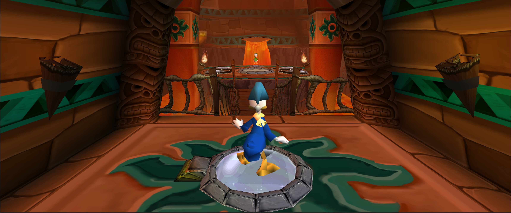

# DonaldDuck_4x_Texture_Pack
Ai upscaled texture pack for Donald Duck: Goin' Quackers/Quack Attack (PC). 
Upscale was mostly done using [4X HDCube3](https://openmodeldb.info/models/4x-HDCube3). For few textures I used other models for best result.

Step 1. Drag & drop "Game.dsb" and "Textures.cnt" into the "Data" folder in your game directory.

Step 2. Download [Rayman Control Panel](https://github.com/RayCarrot/RayCarrot.RCP.Metro/releases) and use it to Synchronize textures.

Step 3. Enjoy!

